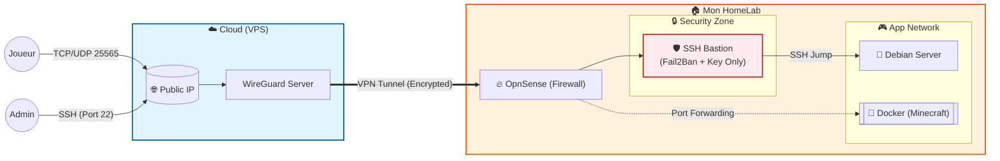
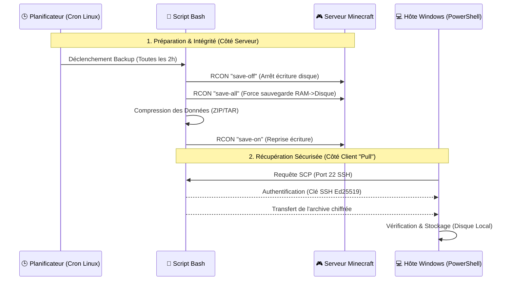

<div align="center">
  
</div>

<div align="center">
  <a href="https://git.io/typing-svg">
    
  </a>
  <br>
</div>


<div align="center">
  
  &nbsp; 
  &nbsp;
  
  &nbsp;
  
</div>


## 📋 Aperçu

Ce projet démontre la mise en œuvre d'une **infrastructure hybride sécurisée** (Cloud + On-Premise) pour l'hébergement de services stateful critiques.
L'objectif principal est de créer un serveur minecraft entre ami en exposant un service hébergé localement (HomeLab) tout en masquant l'IP résidentielle et en appliquant une politique de **Zero Trust** sur les accès administratifs.

L'architecture repose sur un tunnel chiffré traversant un pare-feu périmétrique, avec une ségrégation stricte des flux via un **Bastion SSH**.

## 🏗️ Architecture de mon réseau


## Stateful Management (Les données persistentes)

1. **Isolation du volume** : Les données (data/world etc.), les logs et les configurations du serveur sont découplés/séparé/indépendant du conteneur via des **Docker Volumes**. Le conteneur est éphémère mais la donnée elle est persistante.

2. **Backup**

La stratégie de sauvegarde repose sur un modèle "Pull" (l'hôte récupère les données) pour garantir qu'une compromission du serveur n'affecte pas l'intégrité des archives existantes. (Car j'ai déjà eu un problème de corruption et c'est pas cool)

### 🔄 Comment est fait la sauvegarde !


Je mettrai les petit script dans le repo bien sûr !

## 🔐 Durcissement de la Sécurité (Défense en Profondeur)

### 1. Segmentation Réseau
* **Tunneling VPS (Ingress / Entrant) :** L'adresse IP publique du domicile n'est jamais exposée directement sur Internet. Le VPS agit comme un "fusible" (point d'entrée jetable) et masque l'infrastructure réelle.
* **Isolation (VLAN) :** Le serveur Debian est strictement cloisonné du reste du réseau domestique via des règles de pare-feu **OpnSense**. En cas de compromission du serveur de jeu, le réseau personnel reste protégé.

### 2. Contrôle d'Accès (Bastion SSH)
* **Zero Direct Access :** Aucun accès SSH direct n'est autorisé sur le serveur d'application depuis l'extérieur.
* **Bastion Durci :** Toute administration passe obligatoirement par un serveur rebond (*Jump Server*).
    * Authentification par clés cryptographiques **Ed25519** uniquement.
    * `PermitRootLogin no` : Connexion directe en tant que *root* désactivée.

### 3. Sécurité des Conteneurs (Docker Security)
* **User Namespace Remapping :** Le processus Docker s'exécute avec un UID spécifique (**non-root**). Cela limite considérablement l'impact sur l'hôte en cas d'évasion de conteneur (*Container Breakout*).
* **Resource Limits :** Des quotas stricts (CPU & RAM) sont définis dans le `docker-compose.yml` pour empêcher tout déni de service (DoS) qui pourrait surcharger la machine hôte.


## Les technologies utilisés

| Couche (Layer) | Technologie | Rôle & Usage Spécifique |
| :--- | :--- | :--- |
| **🌐 Ingress / Réseau** | **WireGuard** | Tunneling chiffré (VPN) Site-to-Site pour masquer l'IP réelle. |
| **🔥 Securité périmétrique** | **OpnSense** | Pare-feu, NAT, VLAN Tagging et Inspection de paquets (DPI). |
| **🐧 Système d'exploitation** | **Debian / Linux** | Hôte du serveur d'application (Optimisé & Durci). |
| **🐳 Conteneurisation** | **Docker & Compose** | Orchestration du service Minecraft et isolation des processus. |
| **🛡️ Contrôle d'accès** | **OpenSSH** | Accès sécurisé par clés **Ed25519** (Password Auth désactivé). |
| **🤖 Automatisation (Server)** | **Bash & Cron** | Script de sauvegarde : Freeze I/O (`save-off`), Compression & Rotation. |
| **⚡ Automatisation (Client)** | **PowerShell** | Script "Pull" : Récupération sécurisée via **SCP** vers l'hôte Windows. |
| **🎮 Protocole** | **RCON** | Communication directe avec le serveur de jeu pour la gestion d'état (Save/Stop). |

## 🔧 Problèmes & Troubleshooting

Ce projet a nécessité de résoudre plusieurs problématiques techniques liées à l'encapsulation réseau et à la persistance des données.

### 1. Network Fragmentation (WireGuard MTU)
* **Problème :** Instabilité de la connexion et perte de paquets (packet loss) observée lors du passage dans le tunnel VPN. Certains paquets de jeu (UDP) étaient droppés.
* **Analyse :** Le tunnel WireGuard ajoute un *overhead* (en-tête) aux paquets. Avec un MTU par défaut de 1500 (Ethernet standard), les paquets encapsulés dépassaient la taille limite, causant de la fragmentation ou du rejet.
* **Solution :** Calcul et ajustement du **MTU (Maximum Transmission Unit)** à `1420`  sur l'interface WireGuard pour laisser de la place aux en-têtes du protocole.
    ```bash
    # Exemple de fix dans wg2.conf
    MTU = 1420
    ```

### 2. Corruption de données & Atomicité (l'invisible)
* **Problème :** Lors des premiers tests, copier le dossier `/world` pendant que le serveur tournait résultait en des "chunks" corrompus (fichiers ouverts ou en cours d'écriture).
* **Solution :** Implémentation du mécanisme de **Safe-Backup**. Le script force le serveur à vider sa RAM sur le disque (`save-all`) et bloque l'écriture (`save-off`) le temps de la compression `tar.gz`.

### 3. Config Management (JSON & Mods)
* **Problème :** Conflits d'IDs et incompatibilités entre certains mods, empêchant le démarrage du conteneur.
* **Intervention Dev :** * Analyse des logs de crash (Stack Traces Java).
    * Développement de correctifs dans les fichiers `.json` de configuration pour harmoniser les dépendances.
    * Création d'un environnement "Custom" optimisé pour nos besoins spécifiques, plutôt qu'un modpack générique. (changement taux de drops/ spawn de certains mobs dans des biomes etc.)

Merci d'avoir pris le temps de lire !